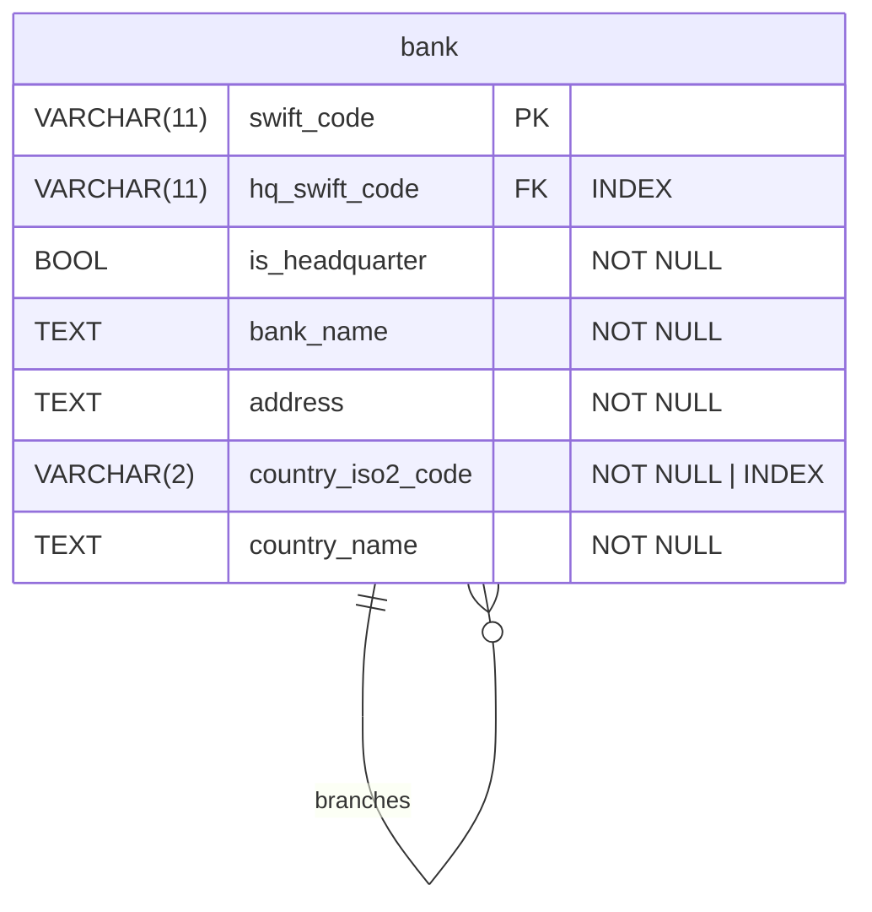

# swift-api

Parse CSV, upload data to DB and serve it with an API. Written in Go, using Postgres for the database.

## How it works

The application is split into 2 binaries: `parser` and `server`. Parser reads the CSV and inserts the data into the DB (only if the table is empty to prevent accidentally erasing modified data). Then, the server makes the data available under a REST API. The app is containerized, and the DB data is persisted in a volume.

## Usage

### Running the containerized application

1.  First, create a `.env` file with the required variables. All variable names are listed in `.env.example`.
2.  Run `docker compose up -d` to start the application (I tested with docker `v28.0.4`).
3.  Check the `api` container's logs to ensure everything is running correctly.
4.  Make HTTP requests to `localhost:8080`.

### Local development

1.  First, create a `.env.development.local` file with the required variables. All variable names are listed in `.env.example`. Note that `DB_HOST` **must be** set to `localhost`.
2.  Install all packages with `go mod tidy`.
3.  Run `docker compose up db -d` to start the database.
4.  You need to run DB migrations. You can do this using any method, for example:

    - `psql "postgres://${DB_USER}:${DB_PASS}@${DB_HOST}:5432/${DB_NAME}?sslmode=disable" -f ./migrations/*.up.sql`
    - `migrate -path migrations -database "postgres://${DB_USER}:${DB_PASS}@${DB_HOST}:5432/${DB_NAME}?sslmode=disable" up` (using `go-migrate`)

5.  Run `make parse` to parse the CSV and to populate the database.
6.  Run `make serve` to start the API server.

### Testing

I used [testcontainers](https://testcontainers.com/) to spin up a unique database for each integration test.

1.  First, create a `.env.testing.local` file with the required variables. All variable names are listed in `.env.example`. Note that `DB_HOST` **must be** set to `localhost`.
2.  Install all packages with `go mod tidy`.
3.  Run `make test`.

## Database schema

### Explanation

At first I tried to normalize it as much as possible and move countries to a separate table. But after some time I realized it would just complicate data fetching and slow down the server, so there's only one table.

Additionaly, I thought about removing `is_headquarter` because if `hq_swift_code` is `NULL` then we already know it is a headquarter. However, in the endpoint 3 request structure, `isHeadquarter` is present so I think it's better to leave it in. Besides, it's easier for a human to check if a bank is the headquarters just by looking at the table contents and seeing an explicit column stating it.
