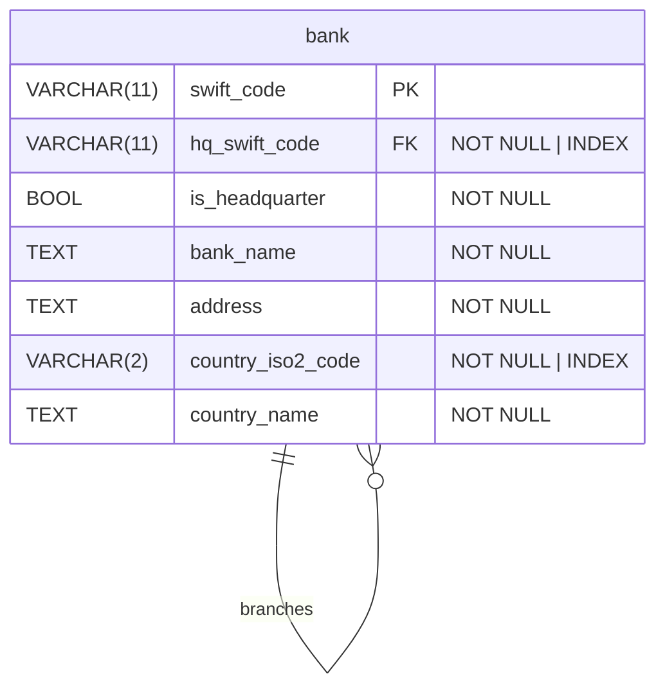

# swift-api

Home exercise for potential interns

## Database schema

```mermaid
erDiagram
    bank {
        VARCHAR(11) swift_code PK
        VARCHAR(11) hq_swift_code FK "NOT NULL | INDEX"
        BOOL is_headquarter "NOT NULL"
        TEXT bank_name "NOT NULL"
        TEXT address  "NOT NULL"
        VARCHAR(2) country_iso2_code "NOT NULL | INDEX"
        TEXT country_name "NOT NULL"
    }
    bank 1--0+ bank: "branches"
```

## Testing

- table-driven approach
