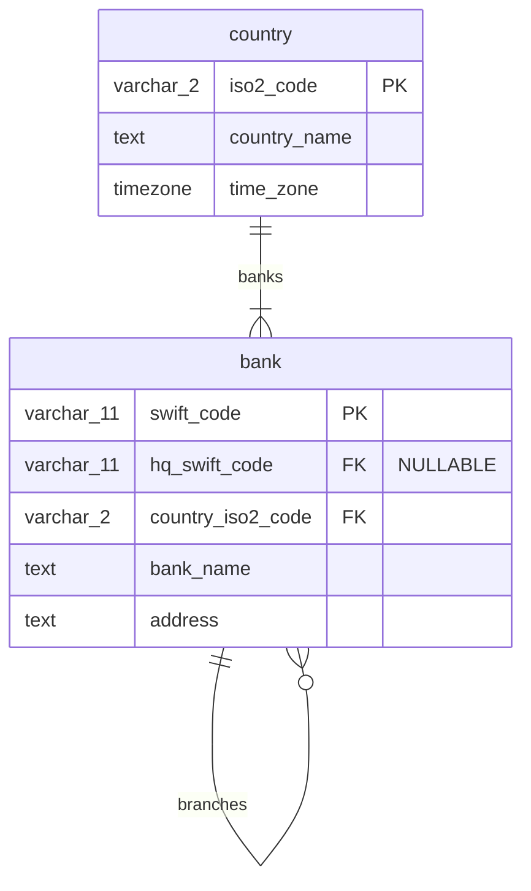

# swift-api

Home exercise for potential interns

## Database schema

All columns are NOT NULL, unless specified otherwise

```mermaid
erDiagram
    bank {
        varchar_11 swift_code PK
        varchar_11 hq_swift_code FK "NULLABLE"
        varchar_2 country_iso2_code FK
        text bank_name
        text address
    }

    country {
        varchar_2 iso2_code PK
        text country_name
        timezone time_zone
    }

    country 1--1+ bank: "banks"
    bank 1--0+ bank: "branches"
```
